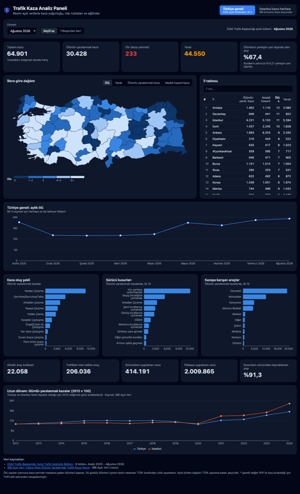
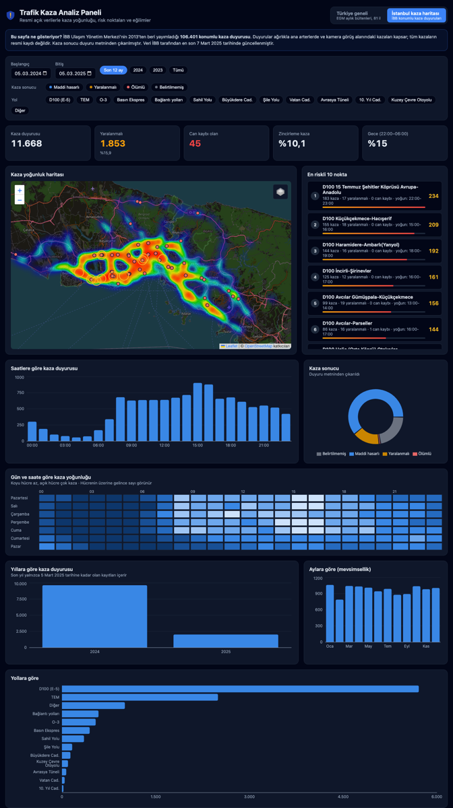
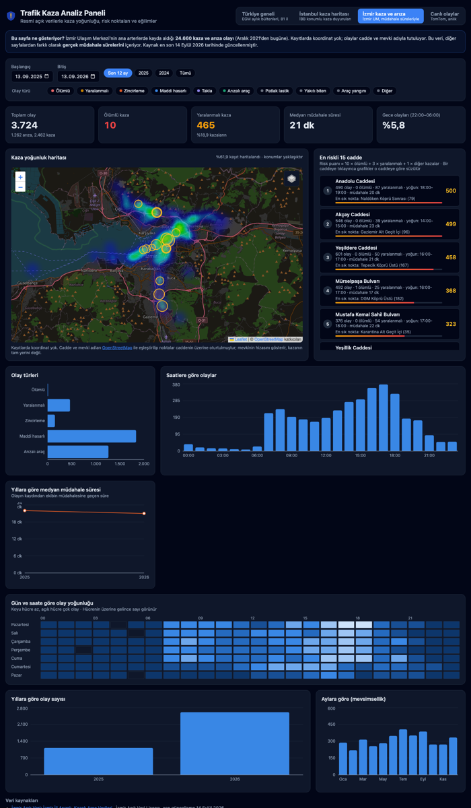
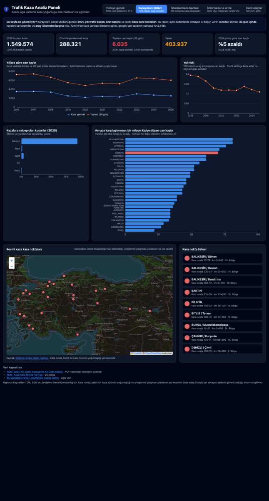

# 🚓 Trafik Kaza Analiz Paneli

[](https://github.com/gorkemguler/kaza-analiz-paneli/actions/workflows/test.yml) [](https://github.com/gorkemguler/kaza-analiz-paneli/actions/workflows/veri-guncelle.yml)

**🌐 Canlı panel: https://gorkemguler.github.io/kaza-analiz-paneli/**

Türkiye'deki trafik kazalarını **resmi açık verilerle** herkese anlaşılır biçimde gösteren bir panel. Kazaların nerede, ne zaman ve hangi koşullarda yoğunlaştığını; hangi yolların ve saatlerin riskli olduğunu haritalar ve grafiklerle anlatır.

Kurumların PDF ve tablolarda dağınık duran verilerini tek yerde toplar. Vatandaşlar kendi şehrinin ve yolunun durumunu görebilir; gazeteciler, araştırmacılar ve yerel yönetimler ise verileri doğrudan indirip kullanabilir.

Panelde iki sayfa var:

| Sayfa | Veri | Kapsam |
| --- | --- | --- |
| **Türkiye geneli** (varsayılan) | EGM Trafik Başkanlığı aylık bültenleri | 81 il, aylık ve yılbaşından beri |
| **Karayolları (KGM)** | KGM yıllık kaza raporu + kara nokta servisi | 10 yıllık seri, 30 günlük ölümler, Avrupa karşılaştırması, 25 kara nokta |
| **İstanbul kaza haritası** | İBB Ulaşım Yönetim Merkezi kaza duyuruları | 106 bin konumlu kayıt, 2013–2025 |
| **İzmir kaza ve arıza** | İzmir Ulaşım Merkezi kayıtları | 24.660 olay, 2021–2026, müdahale süreleriyle |
| **Canlı olaylar** (beta) | TomTom Traffic API | 81 ilde anlık kaza, arızalı araç ve yol kapanması |

## Türkiye geneli



- **İl haritası:** Ölü, yaralı, ölümlü-yaralanmalı kaza ya da maddi hasarlı kaza sayısına göre renklenir.
- **İl tablosu:** Aranabilir ve sıralanabilir. Bir ile tıklayınca o ilin aylık eğilimi açılır.
- **Ülke geneli göstergeler:** Kaza, ölü ve yaralı sayıları; ölümlerin yerleşim yeri dışında olan payı.
- **Kaza nedenleri:** Kaza oluş şekli, sürücü kusurları ve kazaya karışan araç türleri.
- **Denetim faaliyetleri:** Alkollü sürücü, trafikten men edilen araç ve uygulanan cezalar.

## İstanbul kaza haritası



- **Isı haritası:** Kaza yoğunluğunu gösterir. Can kaybı olan kazalar ayrıca işaretlenir.
- **En riskli 10 nokta:** Yaklaşık 500 m'lik bölgelerde puanlanır. Her nokta için en yoğun saat aralığı verilir.
- **Gün × saat matrisi:** Hangi gün, hangi saatte kaza yoğunlaştığını gösterir. Yola çıkarken riskin arttığı saatleri görmek için.
- **Filtreler:** Tarih aralığı, kaza sonucu (maddi hasarlı, yaralanmalı, ölümlü) ve yol (D100, TEM, Basın Ekspres…).

Risk puanı = kaza sayısı + 3 × yaralanmalı kaza + 10 × can kaybı olan kaza

## İzmir kaza ve arıza



İzmir Büyükşehir'in açık verisi, diğer kaynaklarda olmayan bir alan içeriyor: **gerçek müdahale süreleri**. Olayın kaydı ile ekibin müdahalesi arasındaki fark, ekip performansının tek somut göstergesi.

- **En riskli 15 cadde:** Risk puanına göre sıralı. Her cadde için en yoğun saat, medyan müdahale süresi ve en sık olay noktası. Bir caddeye tıklayınca tüm grafikler o caddeye göre süzülür.
- **Müdahale süresi eğilimi:** Yıllara göre medyan süre. Veriye göre 2024'te 17 dakika olan medyan süre 2025'te 24 dakikaya çıkmış.
- **Olay türleri:** Ölümlü, yaralanmalı, zincirleme, maddi hasarlı kazalar ve arıza türleri (arızalı araç, patlak lastik, yakıt bitimi, araç yangını).

- **Kaza yoğunluk haritası:** Kayıtlarda koordinat yok; cadde ve mevki adları ([`scripts/izmir-konum.mjs`](scripts/izmir-konum.mjs)) OpenStreetMap ile eşleştirilip noktalar caddenin üzerine oturtuluyor. Kayıtların yaklaşık **%62'si** haritalanabiliyor, cadde seçilince bu oran daha da yükseliyor. Noktalar **yaklaşıktır**: mevkinin cadde üzerindeki hizasını gösterir, kazanın tam yerini değil.

## Karayolları (KGM)



- **30 günlük can kaybı:** Aylık bültenler yalnızca kaza yerinde ölenleri sayar. KGM raporu, 30 gün içinde hayatını kaybedenleri de verir. 2025'te kaza yerinde 2.541 kişi ölmüşken gerçek can kaybı **6.035**.
- **Yol riski:** 100 milyon araç-km başına can kaybı. Trafik her yıl arttığı için ham kaza sayısı yanıltıcı olabiliyor; bu ölçü artıştan arındırıyor.
- **Avrupa karşılaştırması:** Bir milyon kişiye düşen can kaybında Türkiye 28 ülke arasında 5. sırada (70 kişi; diğer ülkelerin ortalaması 47). Yalnızca Bulgaristan, Romanya, Letonya ve Hırvatistan'da oran daha yüksek.
- **Resmi kaza kara noktaları:** KGM'nin belirlediği, iyileştirme çalışması yürütülen yol kesimleri haritada ve listede.

## Canlı olaylar (beta)

- **Anlık olaylar:** 81 ilin tamamında kazalar, arızalı araçlar, yol ve şerit kapanmaları, tehlikeli durumlar ve sıkışıklıklar. 5 dakikada bir yenilenir.
- **Olay listesi:** Önce kazalar, sonra en yeni olay üstte olacak şekilde sıralanır. Bir olaya tıklayınca harita oraya yakınlaşır.
- **Sorgu alanı:** Her il için sınırlarından üretilmiş tek bir kutu sorgulanır (kota için il başına 1 istek). Büyük illerde kutu, TomTom'un 10.000 km² sınırı nedeniyle il merkezi çevresiyle sınırlıdır.
- **Zaman filtresi:** Yol kapanmalarının bir kısmı aylar önce başlamış uzun süreli çalışmalardır; varsayılan görünüm son 24 saatte başlayan olayları gösterir.

**Lisans kısıtı:** TomTom şartları (md. 11.4 ve 11.6), sonuçların saklanmasını, birden çok kullanıcıya sunmak için önbelleğe alınmasını ve türetilmiş veritabanı oluşturulmasını yasaklar. Bu yüzden:

- Veri her ziyaretçinin **tarayıcısında anlık çekilir**, sunucuda, depoda ya da tarayıcı belleğinde **saklanmaz**.
- TomTom verisi `acik-veri/` klasörüne **eklenmez**, geçmiş analizi yapılmaz.

**Kurulum:**

1. [developer.tomtom.com](https://developer.tomtom.com) adresinden bir API anahtarı alın.
2. TomTom panelinde anahtar için **Domain whitelist** özelliğini açın ve kendi alan adınızı ekleyin. Bu adım zorunludur: kısıtlama açıkken anahtar yalnızca kendi sitenizden gelen isteklerde geçerlidir, başka bir alan adına kopyalandığında TomTom isteği reddeder.
3. Anahtarı GitHub'a Actions secret olarak ekleyin (`gh secret set TOMTOM_API_KEY`), ardından siteyi yeniden yayınlayın (`gh workflow run pages.yml`).

Yerelde denemek için `client/.env.local` dosyasına `VITE_TOMTOM_KEY=...` yazın (bu dosya git'e eklenmez) ve whitelist'e `localhost` ekleyin.

## 📂 Açık veri

EGM'nin PDF bültenlerinden çıkarılan ve doğrulanan tüm tablolar [`acik-veri/`](acik-veri) klasöründe **JSON ve CSV** olarak herkese açık:

| Dosya | İçerik |
| --- | --- |
| [`egm/ulke-aylik.csv`](acik-veri/egm/ulke-aylik.csv) | Ülke geneli aylık kaza, ölü, yaralı |
| [`egm/iller-aylik.csv`](acik-veri/egm/iller-aylik.csv) | 81 ilin aylık verileri |
| [`egm/tablolar-aylik.csv`](acik-veri/egm/tablolar-aylik.csv) | Oluş şekli, sürücü kusurları, araç cinsleri, cezalar |
| [`egm/bultenler/`](acik-veri/egm/bultenler) | Her bültenin tamamı (JSON) |
| [`ibb/istanbul-kaza-duyurulari.csv`](acik-veri/ibb/istanbul-kaza-duyurulari.csv) | İstanbul'da 106 bin konumlu kaza kaydı |
| [`izmir/izmir-kaza-ariza-olaylari.csv`](acik-veri/izmir/izmir-kaza-ariza-olaylari.csv) | İzmir'de 24 bin kaza/arıza olayı, müdahale süreleriyle |
| [`izmir/mevki-konumlari.csv`](acik-veri/izmir/mevki-konumlari.csv) | İzmir mevki adlarının koordinatları (OSM eşleştirmesi, ODbL) |
| [`kgm/kara-noktalar.csv`](acik-veri/kgm/kara-noktalar.csv) | KGM'nin resmi kaza kara noktaları, koordinatlarıyla |

```python
import pandas as pd
iller = pd.read_csv("https://raw.githubusercontent.com/gorkemguler/kaza-analiz-paneli/main/acik-veri/egm/iller-aylik.csv")
```

Alan açıklamaları, kod örnekleri ve lisans bilgisi için [`acik-veri/README.md`](acik-veri/README.md) dosyasına bakın. Dosya listesi ve adresleri [`acik-veri/index.json`](acik-veri/index.json) içinde. Veriler **her gün otomatik** güncellenir.

## Veri kaynakları

| Kaynak | Biçim | Güncelleme | Lisans |
| --- | --- | --- | --- |
| [EGM Trafik Başkanlığı: Aylık Trafik İstatistik Bülteni](https://trafik.gov.tr/istatistikler37) | PDF | Her ay, izleyen ayın sonuna kadar | Resmi İstatistik Programı |
| [KGM: Kaza Kara Nokta Haritası](https://yol.kgm.gov.tr/kazakaranoktaweb/) | JSON servisi | Düzensiz | Kamu kurumu verisi |
| [İzmir: Arızalı, Kazalı Araç Verileri](https://acikveri.bizizmir.com/dataset/izmir-ili-arizali-kazali-arac-verileri) | XLSX | Düzenli (son: Eylül 2026) | İzmir Açık Veri Lisansı |
| [İBB: UYM Trafik Duyuru Verisi](https://data.ibb.gov.tr/dataset/ulasim-yonetim-merkezi-trafik-duyuru-verisi) | CSV | Durmuş (son: Mart 2025) | İBB Açık Veri Lisansı |
| [İBB: Yıllara Göre Ölümlü Yaralanmalı Trafik Kaza Sayısı](https://data.ibb.gov.tr/dataset/yillara-gore-olumlu-yaralanmali-trafik-kaza-sayisi) | API | Durmuş (son: 2024) | İBB Açık Veri Lisansı |
| [Turkey-Maps-GeoJSON](https://github.com/alpers/Turkey-Maps-GeoJSON) (il sınırları) | GeoJSON | – | [Apache-2.0](docs/LICENSE-tr-iller-geojson.txt) |
| [OpenStreetMap](https://www.openstreetmap.org/copyright) (İzmir cadde ve mevki konumları) | Overpass API | – | ODbL |

### Verileri okurken dikkat

- EGM bültenlerindeki **ölü sayıları yalnızca kaza yerindeki ölümleri** kapsar. 30 günlük ölümleri içeren kesin rakamları TÜİK yıllık olarak yayımlar.
- EGM verilerinde, tarafların kendi aralarında tutanak tuttuğu maddi hasarlı kazalar yer almaz.
- İBB verisi **kaza duyurularıdır**, tüm kazaların resmi kaydı değildir. Ağırlıkla ana arterlerdeki ve kamera görüş alanındaki kazaları kapsar.
- İBB duyurularında kaza sonucu (hasarlı, yaralanmalı, can kaybı) duyuru metninden çıkarılır. Yaklaşık %20'sinde sonuç belirtilmemiştir.
- İBB duyurularındaki bitiş saatleri çoğunlukla duyurunun varsayılan yayın süresidir (~29 veya ~89 dk). Bu yüzden müdahale süresi olarak kullanılmaz.

## Verileri güncelleme

### Otomatik (GitHub Actions)

[`veri-guncelle.yml`](.github/workflows/veri-guncelle.yml) iş akışı elle bir şey yapmaya gerek bırakmaz:

- **EGM ve KGM:** Her gün 08:00'de (TSİ) trafik.gov.tr ile KGM kara nokta servisini kontrol eder. Yeni bülten varsa indirir, doğrular ve testler geçerse `server/data` ile `acik-veri` klasörlerine commit atar ve siteyi yeniden yayınlar.
- **İzmir:** Her pazartesi aynı işi yapar.
- **İBB:** Kaynak Mart 2025'ten beri güncellenmiyor, bu yüzden otomatik işte yer almaz. Yayına dönerse **Actions → Veri güncelle → Run workflow → ibb** ile elle çekilir.
- **Hata olursa:** PDF biçimi değişip toplamlar tutmazsa hiçbir şey yayımlanmaz ve depoda otomatik bir issue açılır.
- **Elle çalıştırma:** GitHub'da **Actions → Veri güncelle → Run workflow** yolunu izleyin.

### Elle (EGM)

Yerelde güncellemek için tek komut yeterli:

```bash
npm run veri:egm
```

Betik şunları yapar:

1. trafik.gov.tr sayfasındaki bülten bağlantılarını bulur ve henüz işlenmemiş PDF'leri indirir.
2. PDF'teki tabloları okur: genel toplamlar, oluş şekli, kusurlar, araç türleri, 81 il, cezalar.
3. **Her tabloyu doğrular.** Satırların toplamı PDF'teki TOPLAM satırını tutmazsa hata verir ve dosyayı yazmaz.
4. PDF'te boş bırakılmış tek bir hücre varsa (örneğin Ağustos 2026'da Sinop) değeri TOPLAM satırından hesaplar ve işaretler.
5. Sonucu `server/data/egm/YYYY-AA.json` olarak kaydeder ve `acik-veri/` dosyalarını yeniden üretir.

Diğer seçenekler:

```bash
npm run veri:egm -- --hepsi          # tüm bültenleri yeniden işle
npm run veri:egm -- ~/Downloads/bulten.pdf   # elle indirilen bir PDF'i işle
```

Güncellemeden sonra `npm test` çalıştırın.

### İBB ve İzmir

```bash
npm run veri:ibb
npm run veri:izmir         # kayıtlar
npm run veri:izmir-konum   # cadde/mevki adlarını OSM ile koordinatlama
```

Betik, İBB portalından güncel CSV'yi ve yıllık seriyi indirir, kaza duyurularını ayıklar ve `server/data/ibb/` altına sıkıştırılmış olarak kaydeder.

## Nasıl çalışıyor?

Panelin sunucuya ihtiyacı yok, GitHub Pages üzerinde statik site olarak yayınlanıyor. Her şey GitHub'ın kendi sunucularında, otomatik olarak çalışıyor:

```
Her sabah 08:00  ──▶  Veri güncelle (GitHub Actions)
                      trafik.gov.tr'de yeni bülten var mı?
                      ├─ yok  → hiçbir şey yapma
                      └─ var  → indir → ayrıştır → doğrula → test
                                  → server/data + acik-veri commit
                                  → Siteyi yayınla (GitHub Pages)
```

- Türkiye verileri derleme sırasında hazır JSON dosyalarına dönüştürülür.
- İstanbul'daki 106 bin kayıt tarayıcıya bir kez indirilir. Filtreler ve risk noktaları doğrudan tarayıcıda hesaplanır (yaklaşık 0,1 saniye).
- Analiz kodu (`shared/istanbul-analiz.js`) hem tarayıcıda hem isteğe bağlı Node API'sinde aynıdır.

## Kurulum (geliştirme)

Node.js 20 veya üzeri gerekir. İşlenmiş veriler depoda hazır olduğu için kurulumdan hemen sonra çalışır.

```bash
git clone https://github.com/gorkemguler/kaza-analiz-paneli.git
cd kaza-analiz-paneli
npm install
npm run dev        # http://localhost:5173
```

```bash
npm run build      # statik siteyi client/dist içine üretir
npm run preview    # derlenmiş siteyi yerelde açar
npm test           # veri doğrulama testleri
```

Testler, her EGM bülteninde 81 ilin toplamının ülke toplamına eşit olduğunu ve İBB sınıflandırmalarının doğru çalıştığını kontrol eder.

## İsteğe bağlı REST API

Panel API kullanmaz. Başka uygulamalar için aynı analizleri sunan bir Express sunucusu da var:

```bash
npm run api        # http://localhost:3001
```

| Uç nokta | Açıklama |
| --- | --- |
| `GET /api/turkiye/donemler` | Mevcut bülten dönemleri |
| `GET /api/turkiye/donem/2026-08` | Bir ayın tüm tabloları (81 il dahil) |
| `GET /api/turkiye/seri` | Ülke geneli aylık seri |
| `GET /api/turkiye/il/6` | Bir ilin (plaka kodu) aylık serisi |
| `GET /api/istanbul/meta` | Tarih aralığı, kaza sonucu ve yol listeleri |
| `GET /api/istanbul/stats` | Toplamlar ve dağılımlar (saat, gün, gün×saat, yıl, ay, yol) |
| `GET /api/istanbul/hotspots?limit=10` | En riskli noktalar |
| `GET /api/istanbul/points` | Harita noktaları |

İstanbul uç noktaları şu filtreleri alır: `from`, `to` (YYYY-AA-GG), `severity` ve `road`. Birden fazla değer virgülle ayrılır.

## Proje yapısı

```
├── client/                     React arayüzü (Vite)
│   ├── public/tr-iller.json    81 il sınırları
│   └── src/
│       ├── pages/              TurkiyePage, IstanbulPage
│       └── components/         İl haritası, il tablosu, kaza haritası, gün×saat matrisi…
├── shared/                     Analiz kodu (tarayıcı + Node ortak)
│   ├── istanbul-analiz.js      Filtre, istatistik, risk noktaları
│   └── izmir-analiz.js         Filtre, istatistik, cadde riskleri, müdahale süreleri
├── scripts/
│   ├── statik-veri.mjs         Panel için statik veri dosyaları (derleme öncesi)
│   ├── acik-veri.mjs           acik-veri/ JSON ve CSV dosyaları
│   ├── egm-guncelle.mjs        EGM PDF indirici
│   ├── izmir-guncelle.mjs      İzmir XLSX indirici
│   ├── izmir-konum.mjs         Cadde/mevki adlarını OSM ile koordinatlama
│   ├── kgm-guncelle.mjs        KGM kara noktaları
│   ├── lib/xlsx.mjs            Küçük XLSX okuyucu
│   ├── ibb-guncelle.mjs        İBB CSV/API indirici
│   └── lib/egm-parser.mjs      PDF tablo ayrıştırıcı
└── server/
    ├── data/                   İşlenmiş veriler (egm/*.json, ibb/*.json.gz)
    ├── src/                    İsteğe bağlı Express API
    └── test/
```

## Yol haritası

- [ ] İl bazında nüfusa göre oran (100 bin kişi başına ölü/yaralı)
- [ ] Bir önceki yılın aynı ayıyla karşılaştırma
- [ ] Waze for Cities (bir kamu kurumu ortaklığıyla; saklanabilir olay verisi)
- [ ] PDF/Excel rapor çıktısı

## Lisans

Kod [MIT](LICENSE) lisanslıdır. `acik-veri/` derlemesi [CC BY 4.0](https://creativecommons.org/licenses/by/4.0/deed.tr) ile paylaşılır. Veriler ilgili kurumların lisanslarına tabidir (yukarıdaki tabloya bakın).
