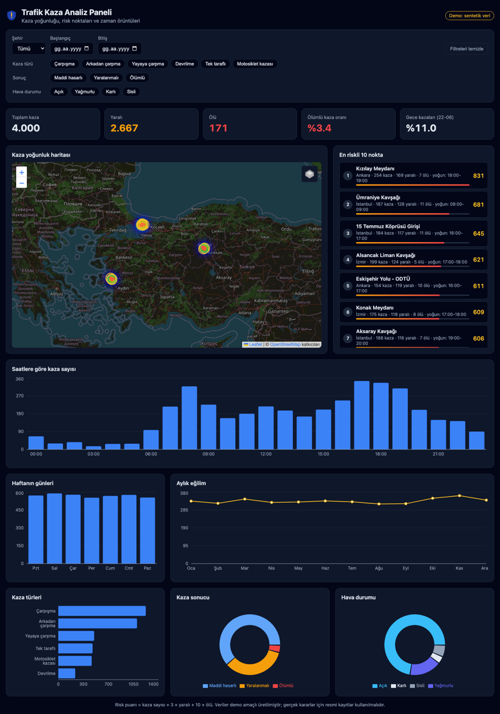

# 🚓 Trafik Kaza Analiz Paneli

Trafik polisi ve kolluk birimleri için kaza verisini harita ve grafiklerle analiz eden bir web paneli. Kazaların **nerede**, **ne zaman** ve **hangi koşullarda** yoğunlaştığını gösterir. Riskli noktaları puanlayarak devriye ve denetim planlamasına yardımcı olur.



> ⚠️ **Not:** Depodaki veriler **demo amaçlı sentetik verilerdir**. Konumlar gerçek kavşaklardır ama kaza kayıtları rastgele üretilmiştir. Gerçek kararlar için resmi kayıtlar kullanılmalıdır.

## Özellikler

- **Isı haritası:** Kaza yoğunluğunu ağırlıklı olarak gösterir (ölümlü > yaralanmalı > maddi hasarlı).
- **Risk noktaları:** Kazalar ~500 m'lik hücrelerde toplanır ve puanlanır. Listeden bir noktaya tıklayınca harita oraya yakınlaşır.
- **Filtreler:** Şehir, tarih aralığı, kaza türü, kaza sonucu ve hava durumu.
- **Özet göstergeler:** Toplam kaza, yaralı, ölü, ölümlü kaza oranı ve gece kazası oranı.
- **Grafikler:** Saatlik dağılım, haftanın günleri, aylık eğilim, kaza türleri, kaza sonucu ve hava durumu.
- **Harita katmanları:** Isı haritası, ölümlü kazalar ve risk noktaları ayrı ayrı açılıp kapatılabilir.

### Risk puanı

```
risk = kaza sayısı + 3 × yaralı sayısı + 10 × ölü sayısı
```

Her risk noktası için ayrıca **en yoğun saat aralığı** hesaplanır. Böylece denetim ekiplerinin hangi saatlerde nerede bulunması gerektiği görülebilir.

## Teknolojiler

| Katman | Teknoloji |
| --- | --- |
| Arayüz | React 19, Vite, Leaflet + leaflet.heat, Recharts |
| API | Node.js, Express |
| Harita | OpenStreetMap |
| Test | `node:test` |

## Kurulum

Node.js 20 veya üzeri gerekir.

```bash
git clone https://github.com/gorkemguler/kaza-analiz-paneli.git
cd kaza-analiz-paneli
npm install
npm run dev
```

- Arayüz: http://localhost:5173
- API: http://localhost:3001

### Üretim modu

```bash
npm run build   # React uygulamasını derler
npm start       # API + derlenmiş arayüz tek sunucudan: http://localhost:3001
```

### Testler

```bash
npm test
```

## API

Tüm uç noktalar aynı filtre parametrelerini alır: `city`, `from`, `to` (YYYY-AA-GG), `type`, `severity`, `weather`. Çoklu seçim için değerler virgülle ayrılır.

| Uç nokta | Açıklama |
| --- | --- |
| `GET /api/meta` | Şehirler, kaza türleri, sonuçlar, hava durumları ve tarih aralığı |
| `GET /api/accidents` | Filtrelenmiş kaza noktaları (harita için) |
| `GET /api/stats` | Toplamlar ve dağılımlar (saat, gün, ay, tür, sonuç, hava) |
| `GET /api/hotspots?limit=10` | En riskli noktalar (en fazla 50) |

Örnek:

```bash
curl "http://localhost:3001/api/hotspots?city=Ankara&severity=Yaralanmalı,Ölümlü&limit=5"
```

## Proje yapısı

```
├── client/                 React arayüzü
│   └── src/
│       ├── App.jsx
│       ├── api.js
│       └── components/     Harita, filtreler, grafikler, risk tablosu
└── server/                 Express API
    ├── src/
    │   ├── data.js         Sentetik veri üretici
    │   ├── analytics.js    Filtreleme, istatistik ve risk noktası hesaplama
    │   └── index.js        API uç noktaları
    └── test/
```

## Gerçek veriyle kullanma

`server/src/data.js` içindeki `generateAccidents()` yerine kendi veri kaynağınızı (CSV, PostgreSQL vb.) okuyan bir fonksiyon yazmanız yeterli. Her kayıtta şu alanlar bulunmalı:

```js
{ id, city, location, lat, lng, date, hour, weekday, type, severity, weather, vehicles, injured, dead }
```

## Yol haritası

- [ ] CSV dosyası yükleyerek analiz
- [ ] PDF/Excel rapor çıktısı
- [ ] Rol tabanlı kullanıcı girişi
- [ ] Önceki dönemle karşılaştırma
- [ ] Denetim noktası öneri modülü

## Lisans

[MIT](LICENSE)
